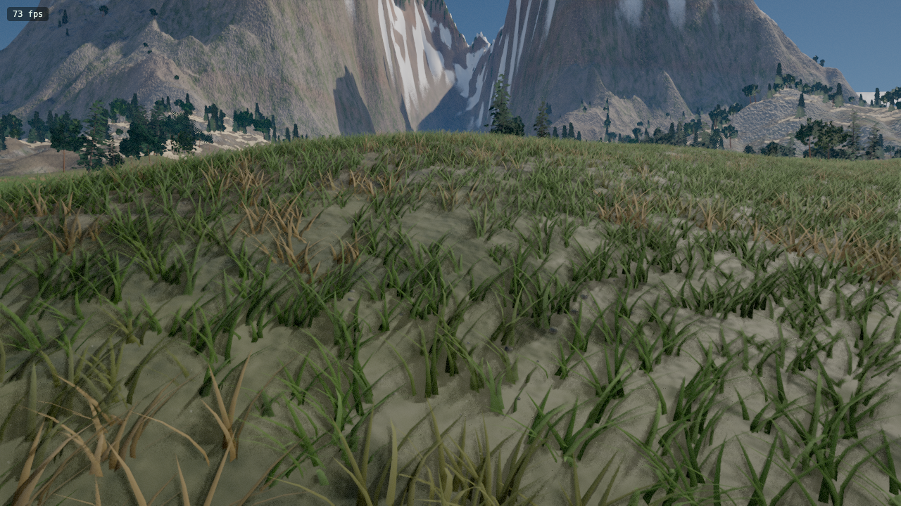
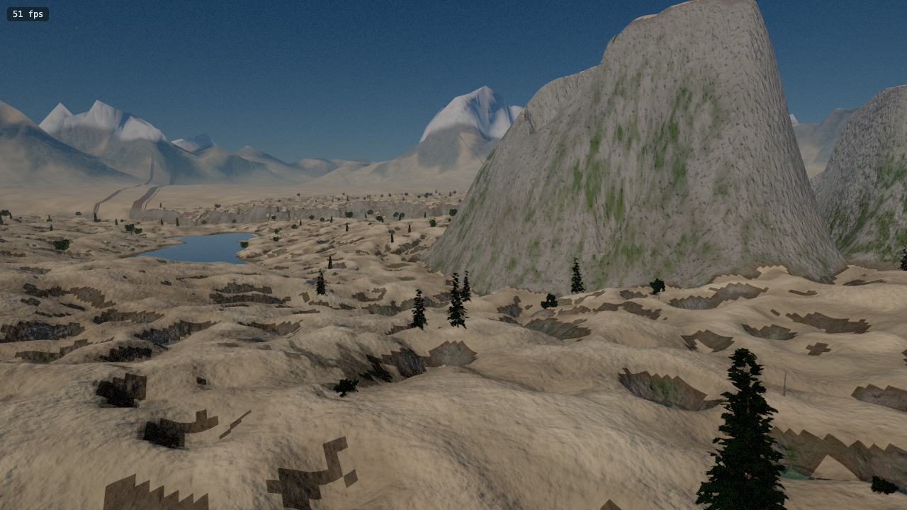
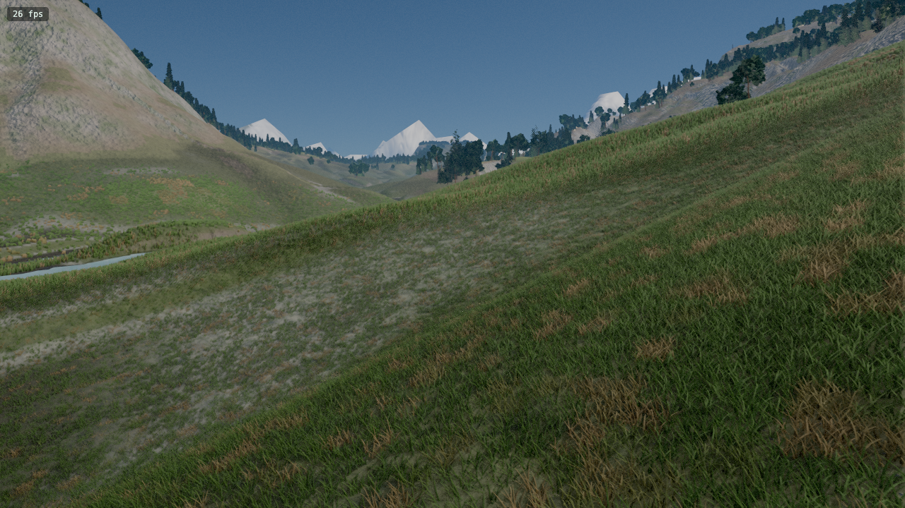
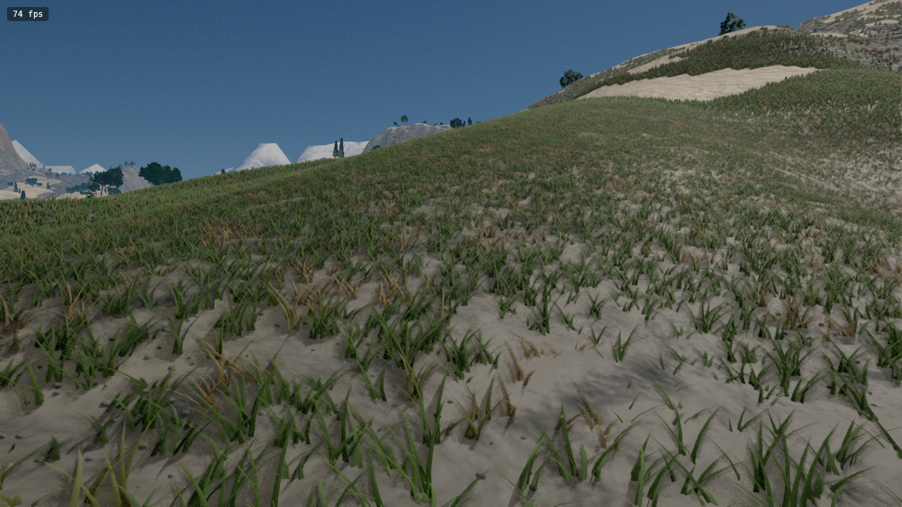
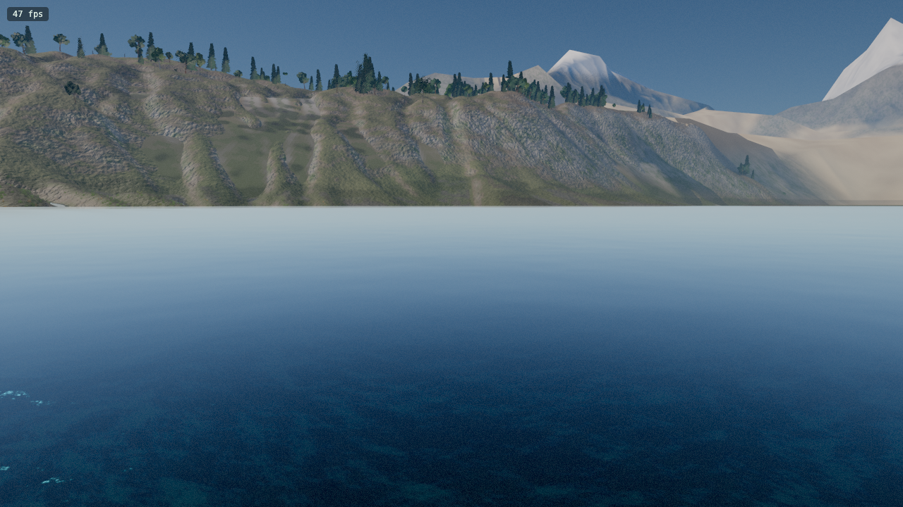
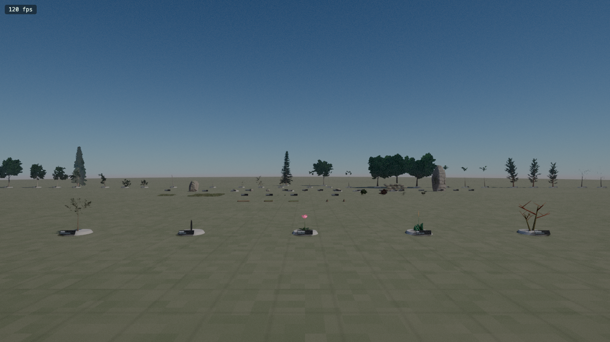
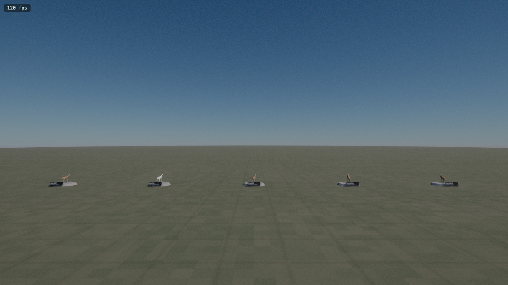

# OpenWorldGen SDK

A fully procedural, extensible WebGPU open-world generator that runs entirely in the browser. Built as an SDK so developers and AI agents can programmatically create high-quality 4×4 km virtual worlds — and easily add new terrains, trees, foliage, rocks, and asset categories.

> Every mesh, texture, shadow, and light in this scene is generated by code at runtime. The repository contains zero image, model, or audio assets.

---

## Screenshots — Verified Biome Profiles

All screenshots below are unedited engine output, captured headlessly via Playwright + WebGPU on the same seed. Each profile is a distinct registered terrain configuration.

| Alpine | Desert |
|---|---|
|  |  |

| Jungle | Grassland |
|---|---|
|  |  |

| Swamp — lakeside with water surface, rocky shore, snowline |
|---|
|  |

### Headless Asset Verification (Playwright + WebGPU)

The tooling boots the world headlessly and visually verifies every registered asset renders correctly:

| All asset types (trees, rocks, flowers, foliage) | Procedural animals (giraffe, oryx, springbok…) |
|---|---|
|  |  |

---

## What it generates

- **Terrain** — 4096² heightfield with hydraulic + thermal erosion, flow-accumulation rivers, moisture-driven biome classification, CDLOD quadtree meshing up to 4 km range
- **Vegetation** — ~190,000 trees grown by a procedural branching grammar (no two trees share a mesh), octahedral impostors, ~450,000 understory instances (shrubs, ferns, flowers, reeds), GPU clustered-Poisson scatter with biome-weighted placement
- **Lighting** — 4-cascade PCSS shadow maps, terrain-relative irradiance probe GI, GTAO, foliage translucency
- **Atmosphere** — Hillaire LUT sky + aerial perspective, raymarched volumetric clouds with cloud shadows, froxel canopy light shafts and valley fog
- **Water** — Stream + lake clipmap surfaces, SSR, analytic caustics, obstacle foam
- **Motion** — Hierarchical wind through every plant, 131,072 GPU particles (snow, pollen, leaves)
- **Post** — TAA, bloom, GPU auto-exposure, per-time-of-day filmic grade

**Tech stack:** `three.js WebGPURenderer` · TSL compute shaders · WGSL · TypeScript strict · Vite

---

## Quick start

```bash
npm install
npm run dev
```

Open `http://localhost:5173` in **Chrome 113+** on desktop (WebGPU required — no WebGL fallback).

**Controls:** Click to capture mouse · WASD to move · Shift sprint · Space jump · V toggle walk/fly · 1–9 bookmarks · F flythrough · F3 GPU HUD

**URL params:** `?seed=N` · `?T=14` (time of day) · `?preset=low|high|ultra` · `?profile=alpine|desert|jungle|swamp|grassland|oceania`

---

## SDK — Extending the world

The generator is built on a **dynamic registry system**. Every terrain, tree species, understory plant, and rock preset is registered at module load. The GPU scattering shaders, geometry pools, and culling passes all read these registries at runtime — no code changes needed elsewhere when you add new assets.

Full documentation: **[`src/sdk/SDK.md`](src/sdk/SDK.md)**

### Add a new terrain profile

```ts
import { TerrainRegistry } from './src/sdk';

TerrainRegistry.register({
  id: 'volcanic',
  label: 'Volcanic Wasteland',
  climate: {
    tempOffset: 12.0,
    moistureScale: 0.15,
    vegDensityScale: 0.2,
    treeScale: 0.15,
    // ...
  },
  layout: { ridgeAmp: 2.2, hillsAmp: 1.5, alpine: 0.8, karst: 0.5, lake: 0.3 },
});
```

### Add a new tree species

```ts
import { VegetationRegistry } from './src/sdk';

VegetationRegistry.registerTree({
  id: 'golden-birch',
  label: 'Golden Birch',
  placement: {
    biomeWeights: [0, 0.1, 0.35, 0.12, 0.4, 0.6, 0, 0.05, 0.15, 0.25],
    moistureSlope: 0.7,
    moistureIntercept: 0.55,
  },
  // ... branching grammar, foliage, bark params
});
```

### Add a new understory / foliage type

```ts
import { VegetationRegistry, VegClass } from './src/sdk';

VegetationRegistry.registerUnderstory({
  id: 'crimson-fern',
  label: 'Crimson Fern',
  cls: VegClass.Fern,
  maxDist: 150,
  placement: {
    biomeWeights: [0, 0, 0.3, 0.2, 0.05, 0.4, 0, 0.8, 0.5, 0],
    canopyRelation: 'clump',
  },
  buildParts: (rng, atlas) => [
    { geo: myGeometry(rng), tris: ..., make: () => myMaterial(), castShadow: false }
  ],
});
```

### Add a new rock preset

```ts
import { RockRegistry } from './src/sdk';

RockRegistry.register({
  id: 'obsidian-boulder',
  presetName: 'boulder',
  params: { radius: 1.4, ridged: 0.22, cuts: 8, cutBite: 0.45, ... },
  tone: { r: 0.08, g: 0.08, b: 0.09 },
  maxDist: 700,
});
```

### Add a custom asset category

```ts
import { CategoryRegistry } from './src/sdk';

CategoryRegistry.register({
  id: 'geysers',
  label: 'Volcanic Geyser Vents',
  cls: 38,
  cellSize: 18.0,
  maxCap: 500,
  cullKind: 'extras',
  placement: {
    biomeWeights: [0, 0, 0, 0, 0, 0.1, 0.8, 0, 0, 0],
  },
  buildPools: (seed) => [...],
});
```

### Run programmatically

```ts
import { WorldGenerator } from './src/sdk';

const gen = new WorldGenerator({
  seed: 'my-world-42',   // string or number
  preset: 'ultra',
  timeOfDay: 14.5,
});

await gen.build(document.getElementById('viewport'));
```

---

## How the SDK pipeline works

When you register a new asset it automatically flows through the entire engine:

```
Registration
  └─ VegetationRegistry.registerTree(config)
       │
       ├─ RegionVeg.ts        reads registry → populates per-region species lists
       ├─ VegLibrary.ts       reads registry → bakes atlases + builds geometry pools (4 variants)
       ├─ Scatter.ts          reads registry → generates TSL If-cascade in GPU compute shader
       └─ Forests.ts          reads registry → adds culling kernel + indirect draw group
```

No manual wiring. No shader edits. No lookup tables to update.

---

## Repository map

| Path | What it is |
|---|---|
| `src/sdk/` | **SDK public surface** — registries, WorldGenerator, exports, documentation |
| `src/sdk/SDK.md` | **Full developer documentation** with code examples for every extension point |
| `src/gpu/passes/Scatter.ts` | GPU clustered-Poisson scatter — select cascades built dynamically from registries |
| `src/vegetation/` | Tree grammar, understory builders, foliage atlases, impostors, culling |
| `src/world/` | Heightfield synthesis, biome classification, terrain profiles |
| `src/gpu/` | All compute passes: bark synth, biome snow, froxels, height synthesis, particles |
| `src/render/` | Materials, impostor runtime, depth prepass, vegetation instancing |
| `src/sky/` | Hillaire atmosphere, volumetric clouds |
| `src/core/` | Engine bootstrap, seed, params, hooks |
| `tools/` | Headless Playwright verification harness (screenshots, pixel sampling, GPU profiling) |

---

## Building

```bash
npm run typecheck   # tsc --noEmit
npm run build       # production bundle via Vite
npm run dev         # dev server with HMR
```

---

## License

MIT
